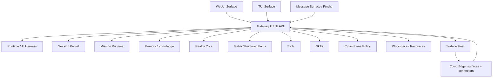

# Gateway API 总框架与关系设计

生成时间：2026-07-13

本文说明 Gateway API 的职责边界、接口关系和前后端使用逻辑。全量接口表见 [`docs/api/gateway-api-reference.md`](../api/gateway-api-reference.md)。

## 设计定位

Gateway 是 Cowd 的 HTTP 控制面和 Surface/Edge 接入中枢。它不应该成为第二套 AI 执行器，而是把 Runtime、Mission、Memory、Reality、Matrix、Tools、Skills、Surface、Connector 等后端能力统一暴露给 WebUI、TUI、外部 surface 和自动化系统。

## 分层关系

## 接口族关系

| 接口族 | 核心职责 | 上游消费者 | 下游能力 | 数量 |
|---|---|---|---|---|
| 公共入口与认证 | 健康检查、WebUI manifest 和认证入口；公共路由不经过统一 Bearer 中间件。 | 浏览器、探活、登录页 | `public` services / kernels | 11 |
| Cowd 核心投影与发布门禁 | Gateway 对外暴露的全局能力图、结构化事实投影、发布门禁和路由清单。 | WebUI、TUI、Runtime 或运维工具 | `core` services / kernels | 10 |
| Runtime 执行核心 | AI Harness 的运行状态、事件、控制平面、配置热加载、turn 提交和 session lease。 | WebUI、TUI、Mission、调试工具 | `runtime` services / kernels | 28 |
| Session 生命周期 | 持久会话、分叉、压缩、统计、事件、运行投影和 session 级管理。 | WebUI、TUI、Surface 消息入口 | `session` services / kernels | 20 |
| 对话消息与 SSE | 用户消息写入、历史消息读取和会话 SSE 流。 | WebUI、TUI、Surface 消息入口 | `message` services / kernels | 9 |
| Mission Control / 多 Session 多 Agent 协同 | Mission Runtime 的全局控制、跨 session 命令、team runtime、steward、审批和代理关系。 | WebUI、Runtime、Agent 协同 | `mission` services / kernels | 34 |
| Agent 目录、组队与运行 | Runtime-owned Agent Definition、Team Template、自动发现、组队、信誉和执行投影视图。 | WebUI、TUI、Runtime 或运维工具 | `agent` services / kernels | 18 |
| Task 阶段化执行 | 任务启动、阶段、产物、审查、失败、完成和取消。 | WebUI、TUI、Runtime 或运维工具 | `task` services / kernels | 8 |
| Context / Evidence | 当前上下文、上下文历史、推荐、压缩和证据引用解析。 | WebUI、TUI、Runtime 或运维工具 | `context` services / kernels | 7 |
| Memory / Knowledge | 记忆层、检索、packet、维护候选、实体、三元组、知识与性能状态。 | WebUI、TUI、Runtime 或运维工具 | `memory` services / kernels | 30 |
| Reality Core | Reality Core 的静态地图、动态 fact flow、promotions、governance、boundaries 和 evidence。 | WebUI、TUI、Runtime 或运维工具 | `reality` services / kernels | 10 |
| Matrix 结构化事实 | 结构化源包、实体、事实、指标、变化、证据包和连接器运行。 | WebUI、TUI、Runtime 或运维工具 | `matrix` services / kernels | 43 |
| Growth / 自我演进 | 成长状态、成长事件与演进线索。 | WebUI、TUI、Runtime 或运维工具 | `growth` services / kernels | 2 |
| Tools 工具执行 | 工具注册表、单工具调用、只读批量、mutation 预览/提交、幂等与意图规划。 | WebUI、TUI、Runtime 或运维工具 | `tool` services / kernels | 17 |
| Skills 技能体系 | 技能目录、投影、详情、文件、翻译、运行记录和 validate/plan/run 动作。 | WebUI、TUI、Runtime 或运维工具 | `skill` services / kernels | 12 |
| Approval 审批 | 待审批、审批响应、风险收据、solo 策略、审批配置与历史。 | WebUI、TUI、Runtime 或运维工具 | `approval` services / kernels | 7 |
| Cross Plane 权限与动作 | 跨 plane 能力授权、风险评估、动作执行、幂等与审计。 | WebUI、TUI、Runtime 或运维工具 | `cross_plane` services / kernels | 14 |
| Surface 接入面 | Surface 注册表、健康、路由、资源、状态、事件、启动/停止/修复和消息投递。 | WebUI、运维、Gateway supervisor | `surface` services / kernels | 29 |
| Edge 热加载与外部包 | Edge 包发现、健康、热加载、surface/connector/resource 投影。 | WebUI、Gateway hot reload | `edge` services / kernels | 7 |
| Connector 数据与服务连接 | 外部资源连接、账号、capability、MCP、source/service/tool connector。 | WebUI、Matrix、Reality、MFG | `connector` services / kernels | 15 |
| Resource 附件资源 | 上传资源注册、资源详情和资源 evidence。 | WebUI、Surface 附件、Runtime 上下文 | `resource` services / kernels | 3 |
| Workspace 文件工作区 | 工作区浏览、文件/目录增删改、上传、下载、raw 读取和 session attachment。 | WebUI、TUI、Runtime 工具 | `workspace` services / kernels | 14 |
| Profile 配置画像 | 配置画像列表、切换和删除。 | WebUI、TUI、Runtime 或运维工具 | `profile` services / kernels | 4 |
| MFG 上层应用 | 制造领域应用：Reality 数据、事件、incident、playbook、case、analysis、action、report。 | WebUI MFG 应用 | `mfg` services / kernels | 79 |
| Harness Eval 评测 | AI Harness 场景评测、运行、报告和最新报告。 | WebUI、TUI、Runtime 或运维工具 | `harness_eval` services / kernels | 10 |
| Audit 审计 | 跨模块审计导出。 | WebUI、TUI、Runtime 或运维工具 | `audit` services / kernels | 1 |
| Slash 命令 | Slash 命令目录、详情、解析、分发和历史。 | WebUI、TUI、Runtime 或运维工具 | `slash` services / kernels | 5 |

## 关键调用链路

### 对话执行链路

1. 前端通过 `/api/sessions` 创建或选择 session。
2. 前端通过 `/api/sessions/:id/messages` 写入用户消息。
3. Gateway 交给 Session/Runtime 处理，并通过 `/api/sessions/:id/stream` 输出 SSE。
4. Runtime 过程中产生 timeline、context envelope、tool events、memory recall、reality flow。
5. 前端通过 `/api/runtime/timeline`、`/api/context/current`、`/api/reality/flow`、`/api/sessions/:id/runs` 做证据展示。

### 多 Agent / 多 Session 协同链路

1. `/api/mission/control` 暴露全局 mission projection。
2. `/api/mission/route`、`/api/mission/sessions/:id/inbox`、`/api/mission/control/sessions/dispatch` 负责跨 session 命令流转。
3. `/api/mission/control/teams/:team_id/*` 负责 team runtime、证据、handoff、synthesis 和取消。
4. `/api/agents/*` 提供 agent 目录、组队模板、运行记录和 team profile。

### Reality / Memory / Matrix 证据链路

1. `/api/context/current` 生成本轮上下文 envelope。
2. `/api/memory/packet`、`/api/memory/recall/explain` 提供非结构化记忆召回与解释。
3. `/api/matrix/*` 管理结构化事实、实体、指标、变化和 evidence packet。
4. `/api/reality/flow`、`/api/reality/promotions` 把运行时事实流和记忆/结构化事实 promotion 显性化。
5. `/api/evidence/resolve`、`/api/reality/evidence/:id`、`/api/matrix/evidence/:id` 提供证据解析入口。

### Surface / Edge / Connector 链路

1. Edge 包提供 surfaces 和 connectors。
2. Gateway 的 SurfaceHost 发现、启动、监控、修复这些外部进程或静态资源。
3. `/api/edges/*` 展示 Edge 包发现和热加载状态。
4. `/api/surfaces/*` 管理消息/静态 surface 生命周期。
5. `/api/connectors/*` 管理数据源、MCP、service connector 和 connector resource。

## 自动化文档策略

- 当前可自动生成：`scripts/generate_gateway_api_docs.py` 从 Axum route 声明生成 Markdown 全量清单。
- 当前运行时真源：`GET /api/gateway/capability-contract`，负责 method/path/source/handler/risk/visibility/schema/tool affordance 的统一导出。
- 当前派生输出：`GET /api/gateway/openapi.json` 生成轻量 OpenAPI 3.1 JSON，`GET /api/gateway/openai-tools` 生成 OpenAI-compatible tool schema。
- 推荐 UI：如需 Swagger/Scalar/Redoc，作为静态 surface 消费 `/api/gateway/openapi.json`；不要另建手写接口清单。

## 设计约束

- Gateway 路由只做 HTTP 适配、鉴权、参数解析和 service 调用，不承载第二套 AI 执行循环。
- Runtime 是 AI Harness 执行核心；Gateway 只负责触发、观察、治理和投影。
- WebUI/TUI/Feishu 等 surface 共享后端服务，不应产生多套业务执行路径。
- Connector/Surface/Edge 可以热加载，但合同必须区分消息接入、静态资源、数据资源和自动化能力。
- 管理台接口应优先提供稳定 projection，避免前端跨多个原始接口猜字段。